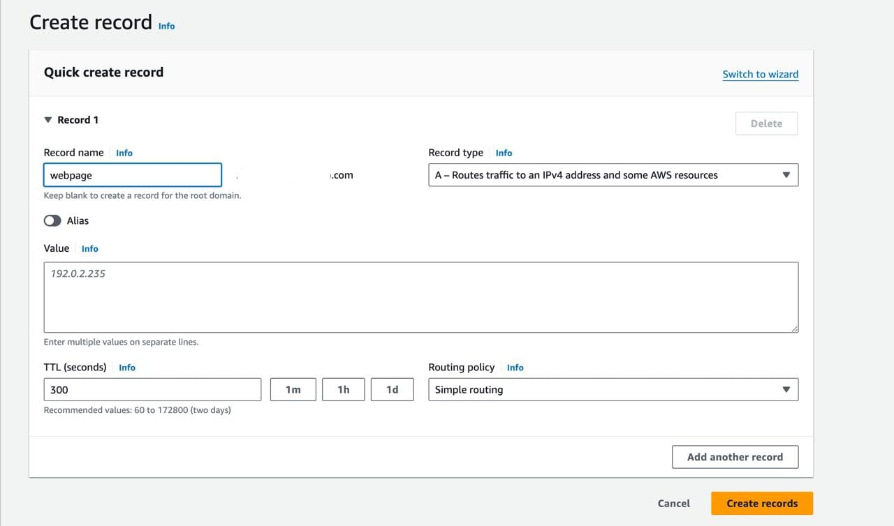

# **Project Overview**

This project will explore the deployment of multiple web applications on a Virtual Machine. The VM is an Ubuntu Linux Machine with Nginx web server installed on it.

One of the advantages of the Nginx Webserver is the ability to use server blocks, which are similar to Virtual Hosts in Apache, to define the configuration details of different applications. This means that the configurations will help to host multiple applications on one server. 

## **Steps**

1. Create a VM (Ubuntu) on AWS.
2. Connect to the VM, update the repository, and install nginx server. Check this [link](https://docs.nginx.com/nginx/admin-guide/installing-nginx/installing-nginx-open-source/) to install nginx on the Ubuntu.
3. I'll be deploying two applications on this server, as seen in these two files: [file 1](./micowebsite/) and [file 2](./webpage/).

## **Setting up the Websites' Root Directories**

* When Nginx is installed, the default homepage is served from the `/var/www/html` directory.


If you were working with a website, you may decide to replace the content of the /var/www/html directory with the new files for your website. However, in this project, I am leaving the default page as it is so that the IP Address of the server can be mapped to the domain name.

The other websites will be mapped to subdomains under the domain name.

I will create two directory structures in the `/var/www` directory like so:

```
sudo mkdir -p /var/www/micowebsite/html

sudo mkdir -p /var/www/webpage/html

```
Note that the `-p` option in the commands above states that the CLI should create the parent directories on the file path since they don't exist yet.

* After creating the directories, you can then set ownership for the html folders. 
  
    ```
    sudo chown -R $USER:$USER /var/www/micowebsite/html
    sudo chown -R $USER:$USER /var/www/webpage/html
    ```

This will make it easy to edit the folder without having to use the `sudo` command everytime.

* Next, copy the file contents of applications into their respective folders on the VM.

Here, you may need different methods to copy and paste your codes into the folder system of the VM.

For me, one of my code directory was on my local machine, so I used the `scp` command to copy from my local machine to the VM. While the other code was on a repository. So, I used the `git clone` command.


## **Setting up Server Blocks to configure the Websites**

* For the default homepage's configuration, the server block resides in the `/etc/nginx/sites-available/default` file. To make new ones for my websites, I created new files for each website server block as shown below:

```
sudo nano /etc/nginx/sites-available/micowebsite
```

* Add these lines of code to the file:
  
    ```
    server {
            listen 80;
            listen [::]:80;

            root /var/www/micowebsite/html;
            index index.html index.htm index.nginx-debian.html;

            server_name micowebsite.domainname.com;

            location / {
                try_files $uri $uri/ =404;
            }
        }
    ```

* For the second one:
  ```
  sudo nano /etc/nginx/sites-available/webpage
  ```

  Add the code lines to the file:

    ```
    server {
            listen 80;
            listen [::]:80;

            root /var/www/webpage/html;
            index index.html index.htm index.nginx-debian.html;

            server_name webpage.domainname.com;

            location / {
                try_files $uri $uri/ =404;
            }
    }
    ```

Note: 

In the configuration file of the server blocks, the port listening line of the code in the default file, `/etc/nginx/sites-available/default`, has `default-server` tag. 

Please note that only one out of all the server blocks created can have the default_server feature enabled. So, any of the blocks that has the default_server tag included in the line of code will automatically default to the homepage of the server.

## **Enabling the Sites Created**
After creating the server block files in the /etc/nginx/sites-enabled/ directory, we need to enable them in the `/etc/nginx/sites-enabled/` directory. This will be achieved by creating a sym link between the `/etc/nginx/sites-enabled/` files and the `/etc/nginx/sites-enabled/` directory.

```
sudo ln -s /etc/nginx/sites-available/micowebsite /etc/nginx/sites-enabled/

sudo ln -s /etc/nginx/sites-available/webpage /etc/nginx/sites-enabled/
```

## **Testing Nginx and Restarting**

```
sudo nginx -t
sudo systemctl restart nginx
```

## **Setting the Domain Names**
This part explains how I used my domain name registered on NameCheap with the VM I created on AWS.

1. Create a hosted zone: This will automatically generate the NS and SOA records. The NS records will be used to link the Namecheap account with the AWS services.

2. Then, create three `A records` on the domain name's hosted zone. 
   
    
    
    


Note that the same IP Address will be used for the `Value`  in the creation of the three records.


## **Testing**
The three websites were served on the browser witht heir respectives URLs ass shown below:


# **Conclusion**

In Conclusion, the three websites were rendered on the browser with their different URLs as set in the server blocks of the Nginx Webserver. 


## Helpful Resources
1. [Setting up Nginx Server Blocks on Ubuntu 16.04](https://www.digitalocean.com/community/tutorials/how-to-set-up-nginx-server-blocks-virtual-hosts-on-ubuntu-16-04)
2. [Install Nginx Webserver on Ubuntu and create a website](https://medium.com/@terminalsandcoffee/create-a-website-with-nginx-on-ubuntu-7e80a3d17d09)
3. [Create Virtual Host on Nginx](https://www.paralleldevs.com/blog/creating-virtual-host-nginx-step-step-guide/git )
4. [Linking Domain Name on Namecheap to AWS Web Services](https://www.namecheap.com/support/knowledgebase/article.aspx/10371/2208/how-do-i-link-my-domain-to-amazon-web-services/)
5. [Creating a hosted Zone on AWS](https://docs.aws.amazon.com/Route53/latest/DeveloperGuide/CreatingHostedZone.html)
6. [Routing traffic for Subdomains](https://docs.aws.amazon.com/Route53/latest/DeveloperGuide/dns-routing-traffic-for-subdomains.html) 
