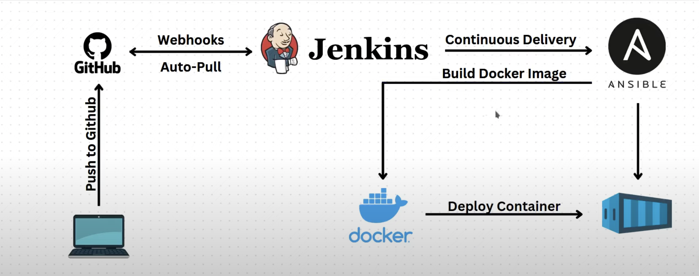
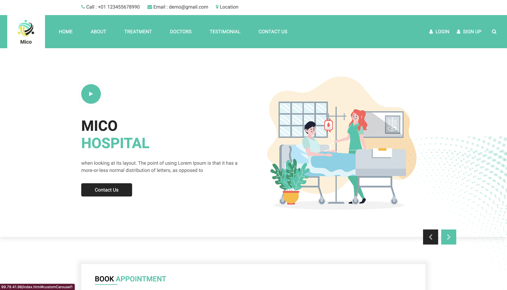
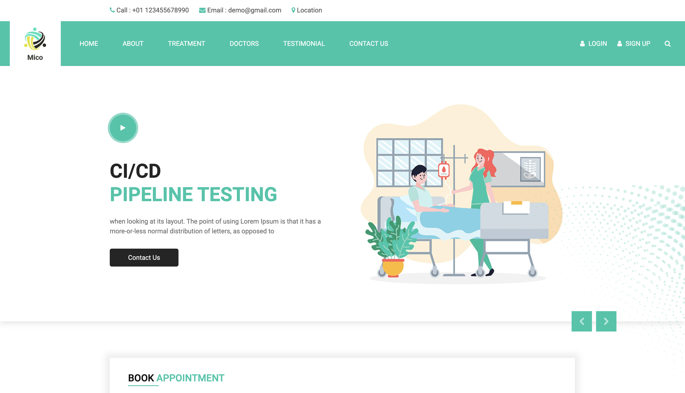

# **About the Project**
I followed this project by **`Aareez Asif`** on [Youtube](https://www.youtube.com/watch?v=h7k45phtZgc&t=334shttps://www.youtube.com/watch?v=h7k45phtZgc&t=334s) to create a CI/CD pipeline with a combination of tools such as Jenkins, Ansible, Docker, and Github Webhooks with servers provisioned on the AWS Cloud.

## **Architectural Diagram**


## **Website's Image**


## **Sample CICD pipeline change**


## **Setting up the Project**
1. Set up a repository to hold the code and include a Dockerfile for Docker Image and Containerization.
2. Provision two Ubuntu VMs on AWS. One will have Ansible and Jenkins, while the other one will have the Docker server.
3. I installed Java Runtime Environment (`openjdk-17-jre`) before Jenkins. Then opened port 8080 on the Jenkins VM through its security group.
4. The next step was installlation of Ansible as seen [here](https://docs.ansible.com/ansible/latest/installation_guide/installation_distros.html#installing-ansible-on-ubuntu).
5. Then, Docker installation, granting permission to the user by adding the Ubuntu user to the Docker group and refreshing the group as shown below:
   
   ```
   sudo usermod -aG docker ubuntu
   newgrp docker
   ```
6. 